# Iddir Bylaws (Samuel Bete's Memorial Iddir) – Mermaid Diagrams

---

## 1. Organizational Structure

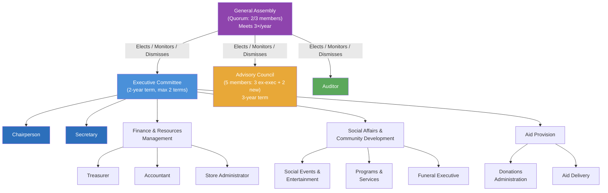

---

## 2. Membership Lifecycle

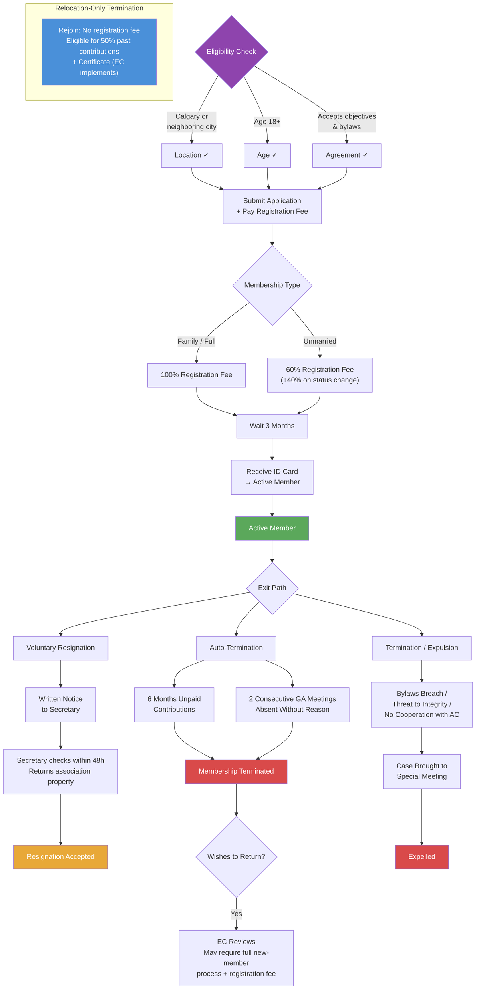

---

## 3. Family Definition (for Membership & Benefits)

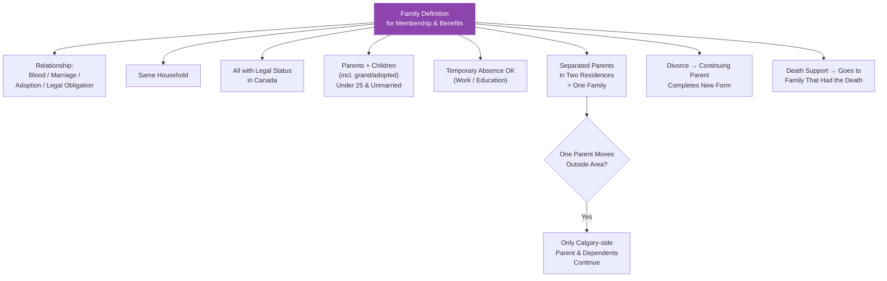

---

## 4. Aid (Funeral) Procedure

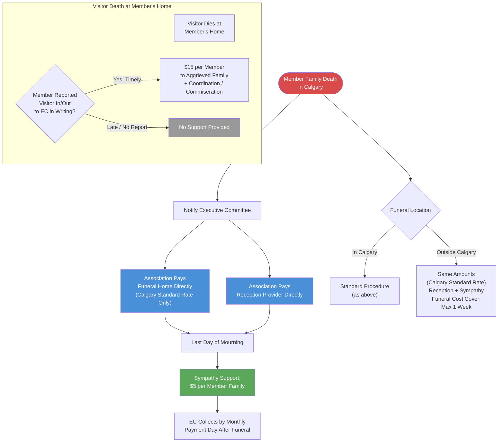

---

## 5. Humanitarian Support (Health / Catastrophe)

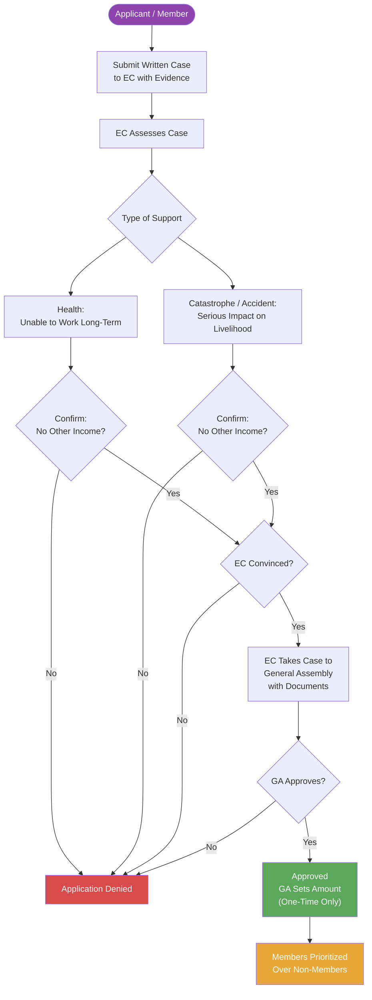

---

## 6. Income & Property

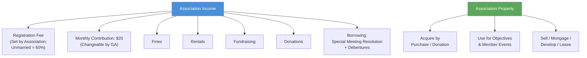

---

## 7. Election Process

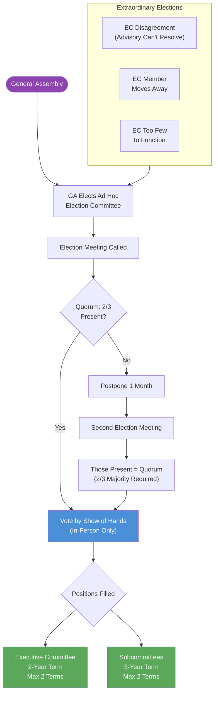

---

## 8. Decision Rules & Quorum Thresholds

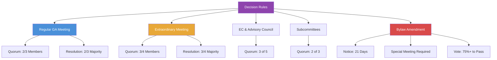

---

## 9. Fines & Disciplinary Escalation

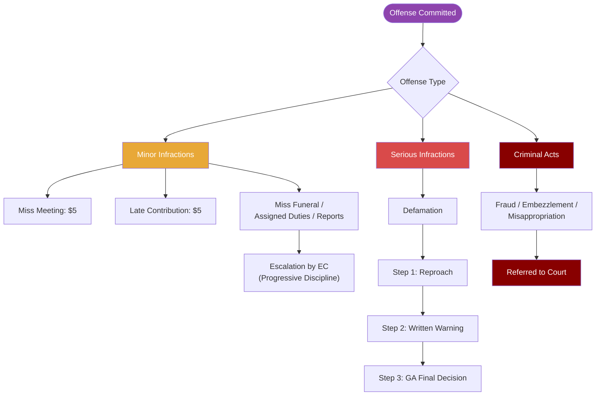

---

## 10. Visitor at Member's Home – Support Eligibility

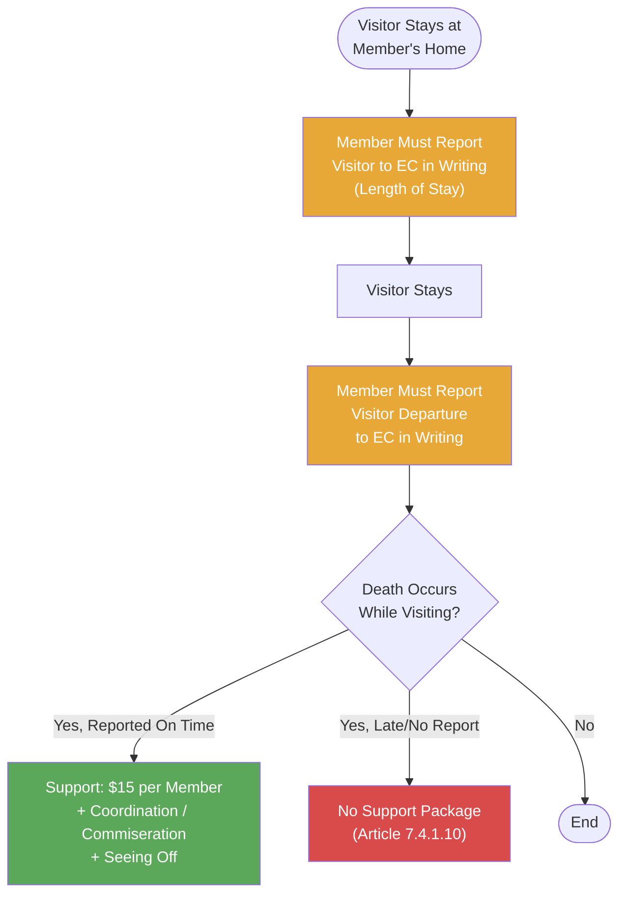

---

## 11. Death Support – Child Over 25 & Divorce Cases

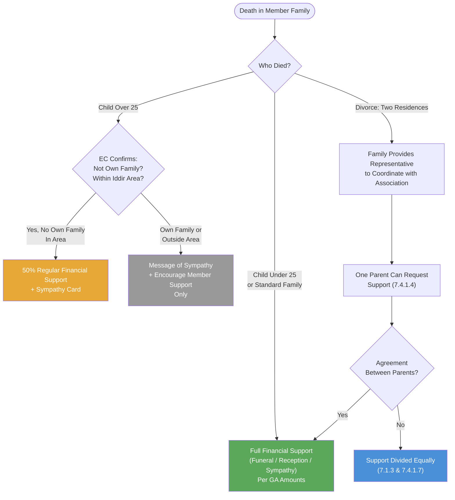

---

## 12. Meeting Notice & Call Rules

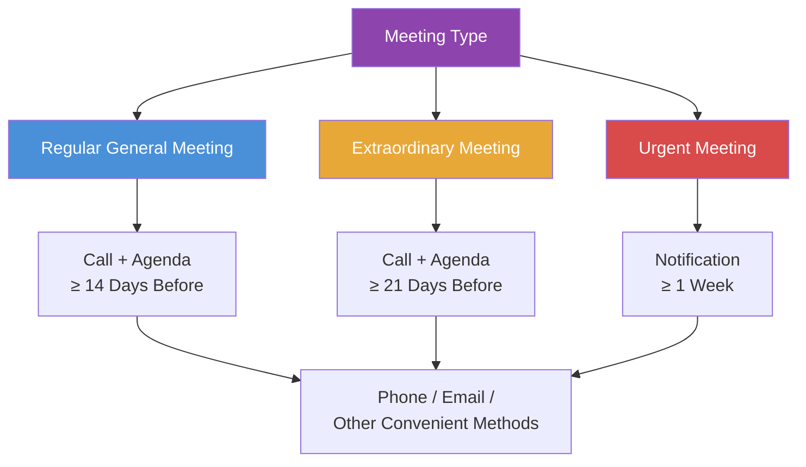

---

## 13. Resignation Flow (Secretary 48h Check)

```mermaid
flowchart TD
    MEMBER([Member Wishes to Resign])

    MEMBER --> WRITE[Submit Written Resignation\nto Secretary\n(Mail / Email / In Person)]

    WRITE --> T0[Receipt by Secretary]
    T0 --> T48[Within 48 Hours]

    T48 --> CHECK{Association Property\nin Member's Possession?}

    CHECK -->|Yes| RETURN[Secretary Ensures\nProperty Returned]
    CHECK -->|No| ACCEPT[Resignation Accepted]

    RETURN --> ACCEPT

    style MEMBER fill:#8e44ad,color:#fff
    style ACCEPT fill:#5ba85b,color:#fff
```
