# SBMI Member Portal RFP Response (Intoria) – Mermaid Diagrams

---

## 1. Project Phases

```mermaid
flowchart LR
    subgraph M1["Month 1"]
        A[Discovery & Design] --> B[Core Development Begins]
    end
    subgraph M2["Months 1–2"]
        B --> C[Core Development]
        C --> D[Financial & Logic Workflows]
    end
    subgraph M3["Month 3"]
        D --> E[Compliance & Security]
        E --> F[Reporting Module]
    end
    subgraph Launch["Launch Phase"]
        F --> G[Soft Launch]
        G --> H[Training & Knowledge Transfer]
        H --> I[Full Launch\nJuly 1, 2026]
    end

    style A fill:#4a90d9,color:#fff
    style B fill:#4a90d9,color:#fff
    style C fill:#5ba85b,color:#fff
    style D fill:#5ba85b,color:#fff
    style E fill:#e8a838,color:#fff
    style F fill:#e8a838,color:#fff
    style G fill:#d94a4a,color:#fff
    style H fill:#d94a4a,color:#fff
    style I fill:#8e44ad,color:#fff
```

---

## 2. User Roles & RBAC

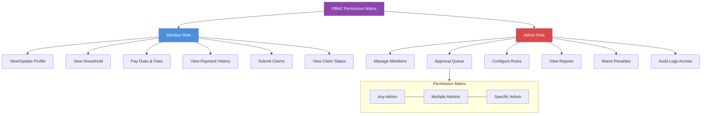

---

## 3. Member Journey

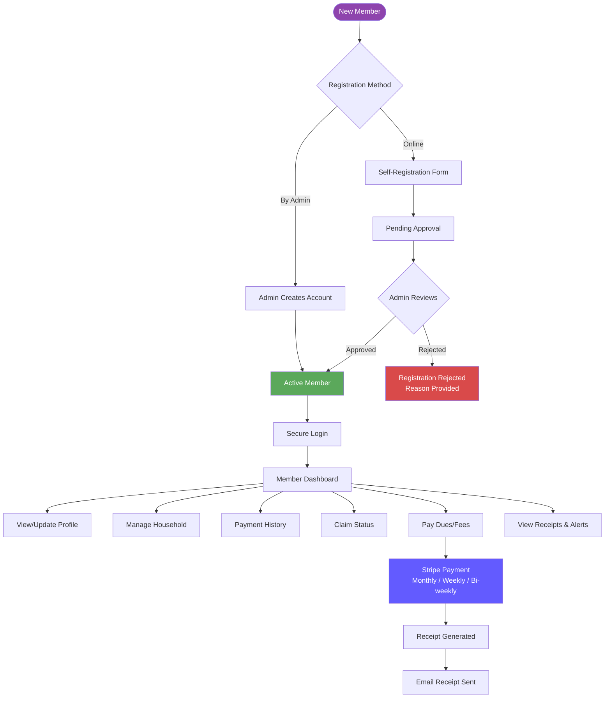

---

## 4. Admin Approval Workflow

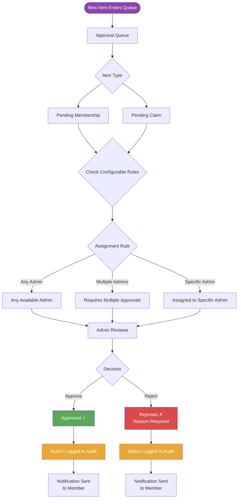

---

## 5. Payment Flow

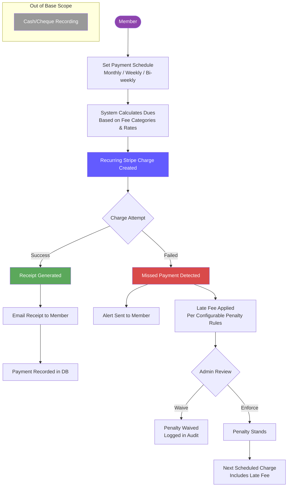

---

## 6. Payment Flow – Sequence Diagram

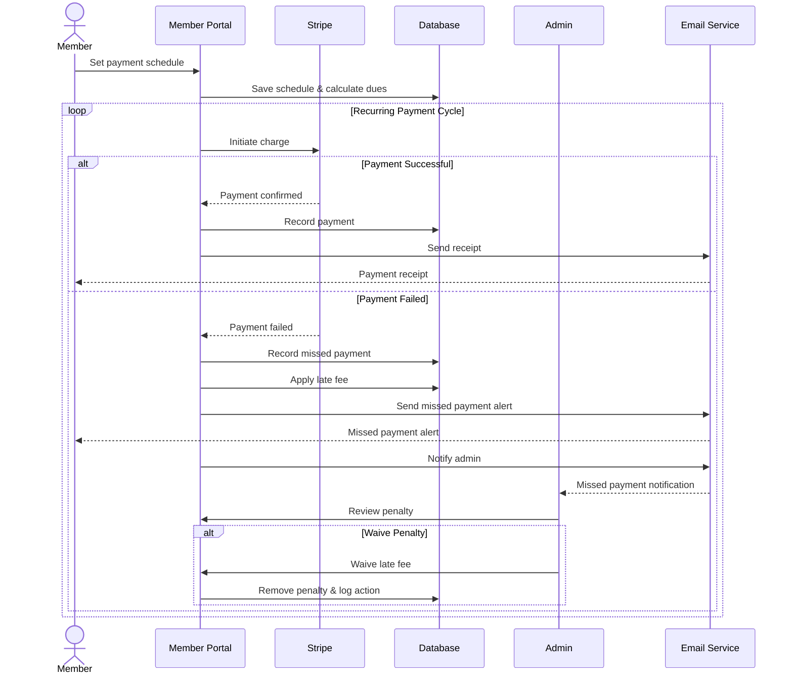

---

## 7. Claims / Benefits Flow

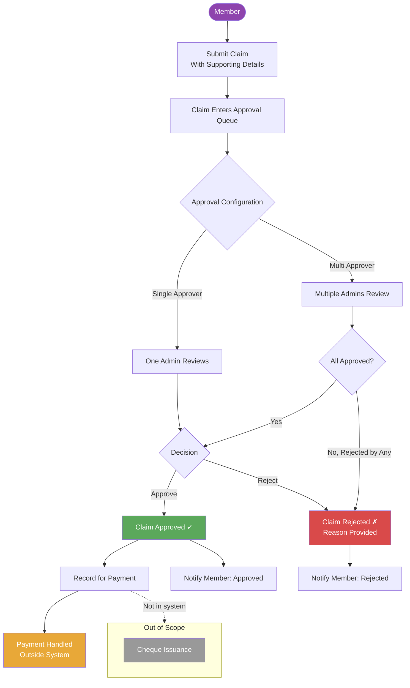

---

## 8. Data Architecture

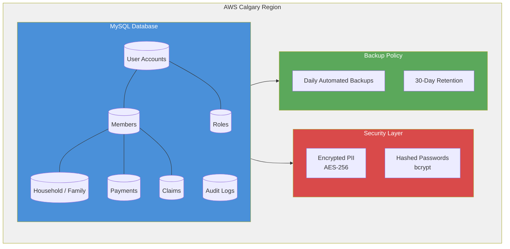

---

## 9. Notification System

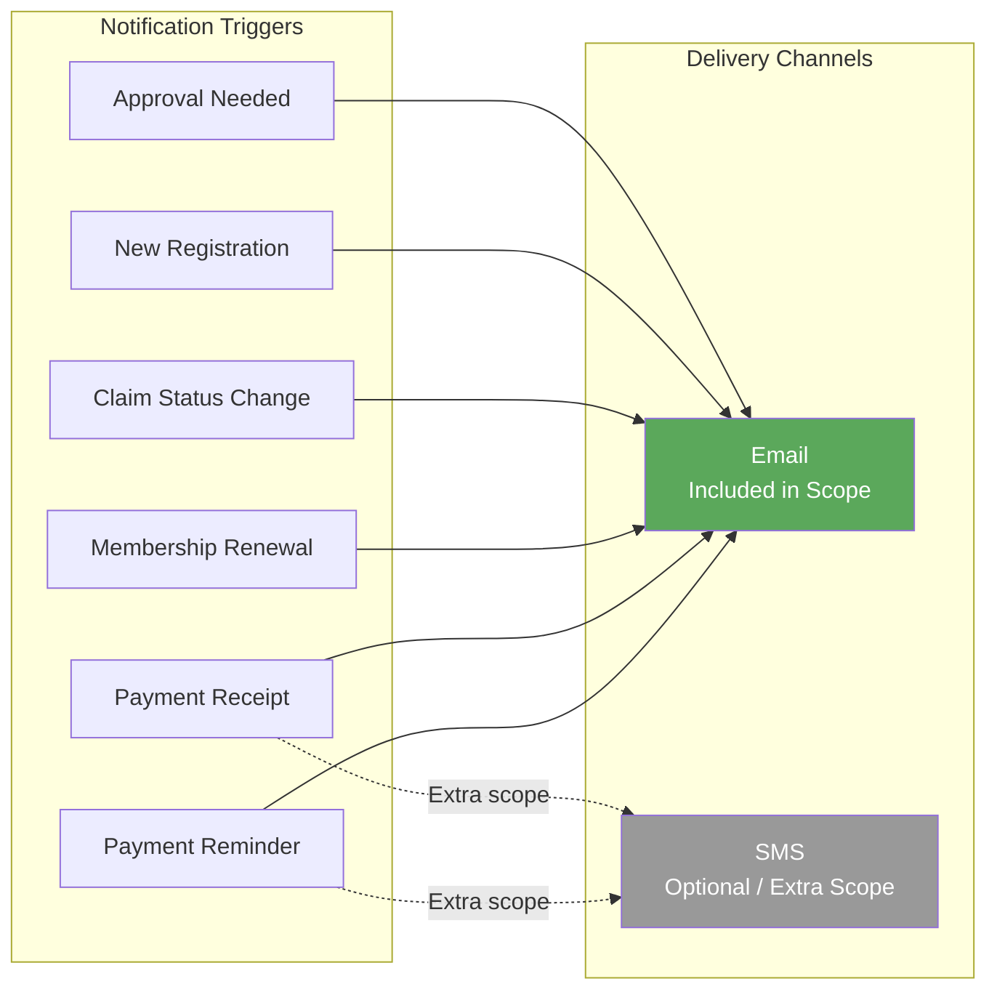

---

## 10. Reporting Module

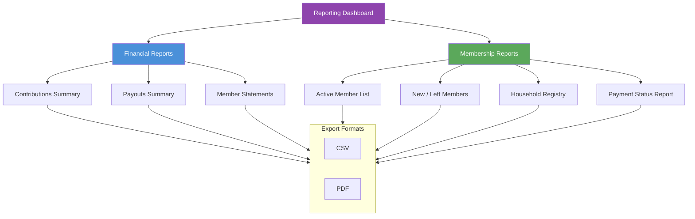

---

## 11. Configurable Rules

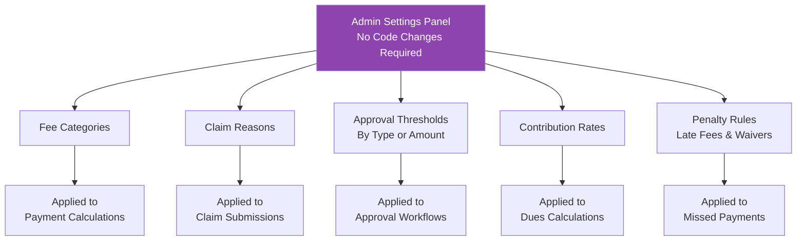

---

## 12. Out of Scope

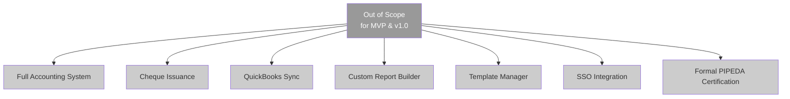

---

## 13. High-Level Solution Context

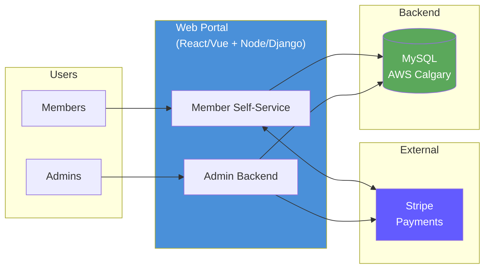

---

## 14. Month 1 Discovery Checklist

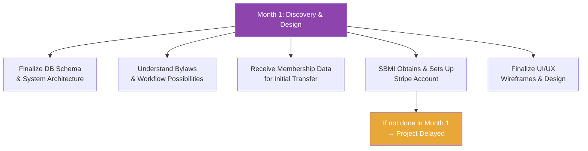
